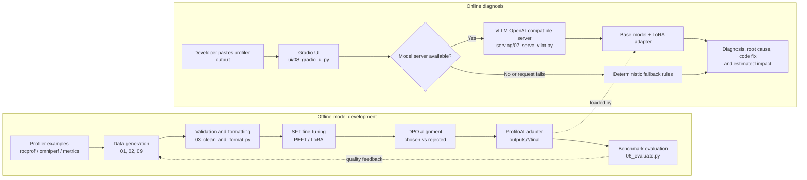

# ProfiloAI

[Live Demo](https://huggingface.co/spaces/Pradeerock/profiloai) | [GitHub Repository](https://github.com/pradeek1120/profiloai)

ProfiloAI is an AMD GPU performance assistant. It turns `rocprof`, `omniperf`,
and training-loop metrics into:

- a likely bottleneck
- a plain-English root-cause explanation
- a concrete code change
- an estimated performance impact

It is designed for developers working with AMD Instinct GPUs, ROCm, PyTorch,
and Hugging Face training workloads.

## Technology Stack

| Area | Technologies |
| --- | --- |
| Language | Python 3.12 |
| UI | Gradio |
| Model training | PyTorch, Transformers, Datasets, Accelerate |
| Fine-tuning | PEFT/LoRA and TRL/DPO |
| Serving | vLLM OpenAI-compatible API |
| GPU platform | AMD Instinct MI300X and ROCm |
| Evaluation | Python benchmark scripts and JSONL datasets |

The project is intentionally Python-first because the UI, training pipeline,
model serving, and evaluation are all implemented in Python. GitHub therefore
shows Python as the dominant repository language; the table above gives the
broader technology picture.

## Why This Project

GPU profilers expose useful metrics, but the output is often difficult to turn
into an engineering decision. ProfiloAI connects a metric such as low memory
bandwidth or high VGPR usage to a practical optimization to investigate next.

The repository contains a complete prototype workflow:

1. Generate profiler-diagnosis training data.
2. Format SFT and DPO datasets.
3. Fine-tune a language model with PEFT/LoRA.
4. Align the model with DPO preference pairs.
5. Evaluate responses with a repeatable benchmark.
6. Serve the adapter through vLLM and use it from a Gradio UI.

## Architecture

ProfiloAI has two connected paths: an offline model-development path and an
online diagnosis path.



### Runtime Responsibilities

| Layer | Responsibility | Repository location |
| --- | --- | --- |
| Input | Accept profiler text and example scenarios | `ui/08_gradio_ui.py` |
| Inference | Generate an AMD-specific diagnosis | vLLM or fallback rules |
| Model serving | Expose an OpenAI-compatible endpoint | `serving/07_serve_vllm.py` |
| Training data | Create and validate SFT/DPO JSONL files | `scripts/` |
| Fine-tuning | Train the LoRA adapter with SFT and DPO | `training/` |
| Evaluation | Score base and adapter-backed responses | `evaluation/` |

The fallback path keeps the demo usable without a GPU. It is intentionally
separate from the trained model path so demo availability does not get
confused with model-quality results.

## Demo

The UI supports two modes:

- **Model mode:** sends requests to a local OpenAI-compatible vLLM server.
- **Demo mode:** uses deterministic rule-based diagnoses when no model server
  is available.

The fallback makes the interface easy to demonstrate without a GPU, but it is
not a substitute for model evaluation.

### Run Locally

Windows PowerShell:

```powershell
py -3.12 -m venv .venv
.\.venv\Scripts\Activate.ps1
pip install -r requirements.txt
python app.py
```

Linux or macOS:

```bash
python3 -m venv .venv
source .venv/bin/activate
pip install -r requirements.txt
python app.py
```

Open the Gradio URL shown in the terminal, select an example, and click
**Diagnose**.

## Training Workflow

Training requires an AMD ROCm environment and a Hugging Face access token.
The intended target is an AMD Developer Cloud MI300X instance.

```bash
python3 -m venv .venv
source .venv/bin/activate
pip install -r requirements-training.txt
cp .env.example .env
```

Set at least `HF_TOKEN` and `BASE_MODEL` in `.env`. Then run:

```bash
python3 scripts/00_check_amd_cloud.py
python3 scripts/01_collect_rocprof_data.py
python3 scripts/09_more_training_data.py
python3 scripts/02_generate_diagnosis_pairs.py
python3 scripts/03_clean_and_format.py
python3 training/04_finetune_sft.py
python3 training/05_dpo_alignment.py
```

The generated datasets are stored in `data/processed/`. Model adapters and
checkpoints are stored under `outputs/`, which is excluded from Git.

## Evaluation

Run the local checks before training:

```bash
python tests/local_test.py
```

The current repository passes 14/14 local checks. The checks cover file
structure, Python syntax, data generation, dataset format, and mocked API
response parsing. GPU training and model-quality evaluation require the
training dependencies and a compatible GPU environment.

After training, run:

```bash
python evaluation/06_evaluate.py
python evaluation/benchmark_comparison.py
```

The evaluation code loads the base model and attaches the saved PEFT adapter.
It does not report a fine-tuned score when the adapter is missing.

The benchmark is a lightweight keyword-based engineering sanity check, not a
human-validated measure of factual accuracy. Results should be reported with
that limitation included.

## Serving

Start the vLLM-compatible server in one terminal:

```bash
python serving/07_serve_vllm.py
```

Start the Gradio UI in another terminal:

```bash
python ui/08_gradio_ui.py
```

The UI sends requests to `http://localhost:8000/v1/chat/completions` using the
model name `profiloai`. Set `VLLM_MODEL` if the server uses another name.

## Project Structure

```text
.
├── app.py                         # Gradio / Hugging Face entry point
├── scripts/
│   ├── 00_check_amd_cloud.py     # ROCm and GPU readiness report
│   ├── 01_collect_rocprof_data.py
│   ├── 02_generate_diagnosis_pairs.py
│   ├── 03_clean_and_format.py
│   └── 09_more_training_data.py
├── training/
│   ├── 04_finetune_sft.py        # PEFT/LoRA supervised fine-tuning
│   └── 05_dpo_alignment.py       # Preference alignment
├── evaluation/
│   ├── 06_evaluate.py
│   └── benchmark_comparison.py
├── serving/07_serve_vllm.py
├── ui/08_gradio_ui.py
├── tests/local_test.py
├── data/                          # Raw and processed JSONL datasets
├── AMD_CLOUD_RUNBOOK.md           # Cloud setup and evidence checklist
└── SUBMISSION.md                  # Hackathon submission copy
```

## Bottlenecks Covered

- memory bandwidth and cache utilization
- low occupancy and VGPR/register pressure
- DataLoader and CPU input stalls
- FP32 versus BF16 / Matrix Core usage
- warp divergence
- CPU/GPU transfer overhead
- kernel launch overhead
- atomic collisions
- multi-GPU all-reduce overhead
- matrix dimension misalignment
- gradient checkpointing overhead

## Current Status

ProfiloAI is a working prototype with a Gradio demo, synthetic domain data,
SFT and DPO training scripts, PEFT adapter evaluation, and vLLM-compatible
serving. Full training and GPU benchmark claims should be made only after
running the training and evaluation workflow on the target AMD environment.


## License

This project is available under the MIT License. See [LICENSE](LICENSE).
